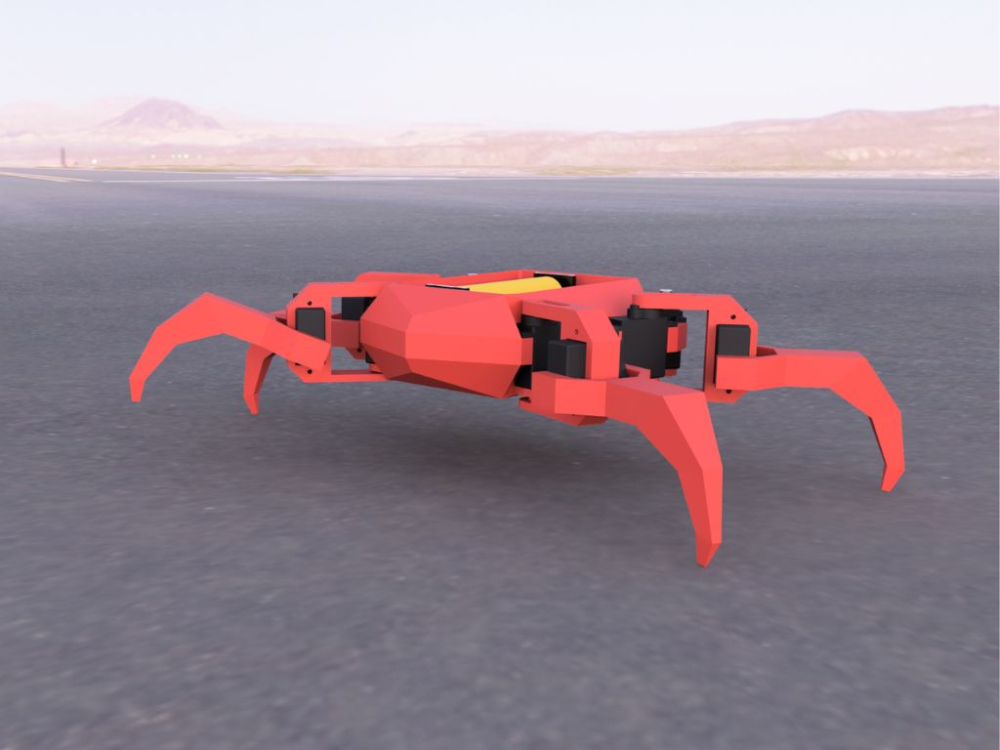
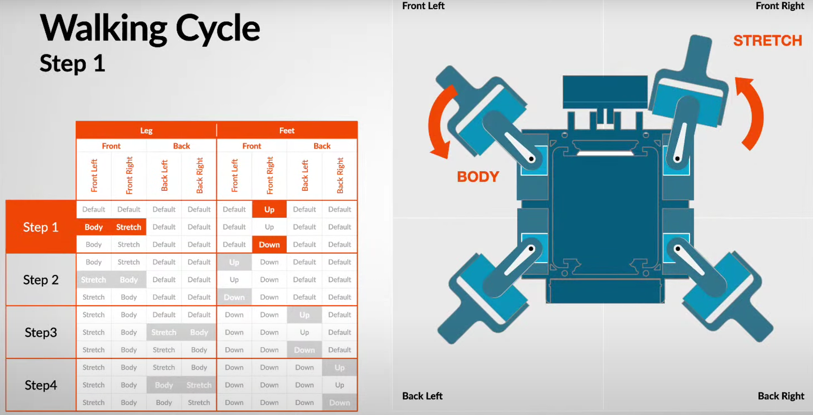
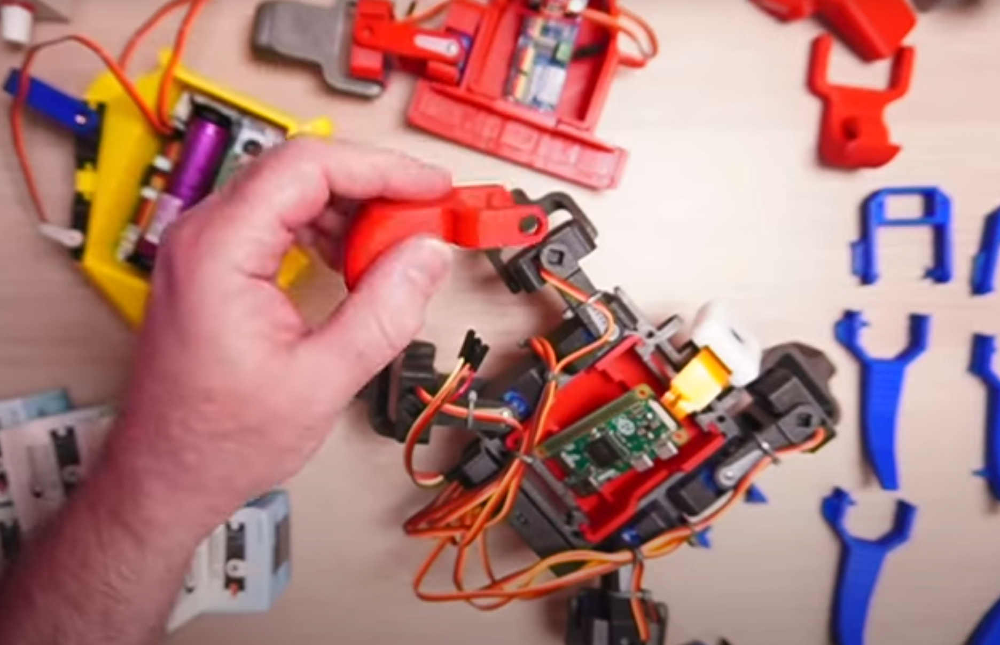
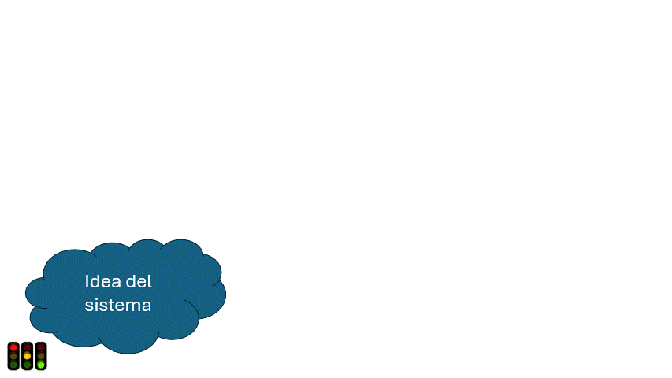
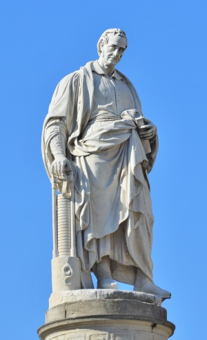
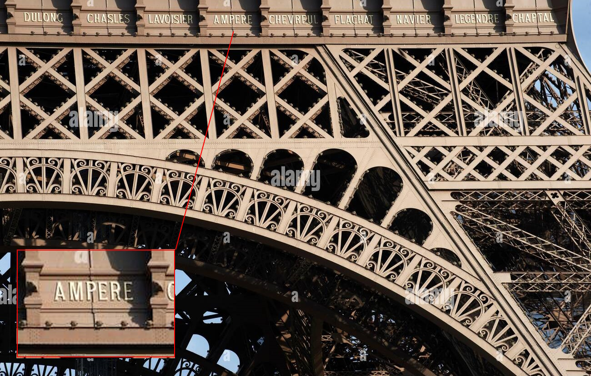
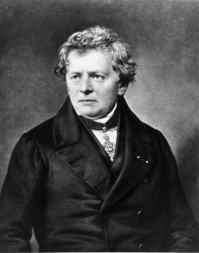
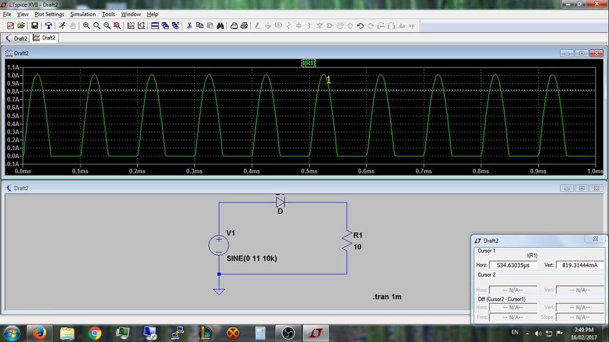
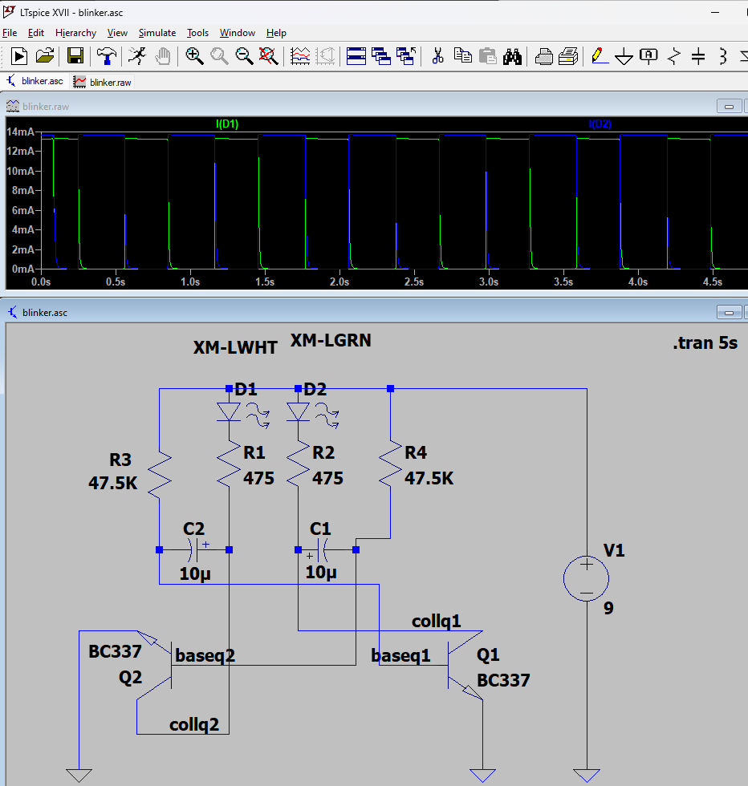
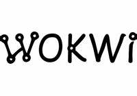

[comment]: # (THEME = league)
[comment]: # (CODE_THEME = base16/zenburn)
[comment]: # (controls: true)
[comment]: # (keyboard: true)
[comment]: # (markdown: { smartypants: true })
[comment]: # (hash: false)
[comment]: # (respondToHashChanges: false)
[comment]: # (slideNumber: true)
[comment]: # (center: false)

## Arduino Day 2024

Arduino, senza hardware

24 marzo 2024

[comment]: # (!!!)

## Progettare - non è tutto semplice

Esempio di realizzazione complessa

<iframe width="560" height="315" src="https://www.youtube.com/embed/aXW4dqvjFx0" title="YouTube video player" frameborder="0" allow="accelerometer; autoplay; clipboard-write; encrypted-media; gyroscope; picture-in-picture; web-share" allowfullscreen></iframe>

Come gestire la complessità ?

[comment]: # (!!! data-auto-animate)
## Progettare - non è tutto semplice

Come gestire la complessità ?

- Meccanica / stampa 3D
- Elettronica e collegamenti
- Potenza richiesta dai motori ?
- Movimenti del robot e programmazione
- Durata della batteria ?
- Facilità di montaggio ?

[comment]: # (!!!)

## Quindi, come fare cose complesse?

Bisogna suddividere il problema in problemini più semplici !

[comment]: # (!!! data-auto-animate)

## Quindi, come fare cose complesse?

Bisogna suddividere il problema in problemini più semplici !

[comment]: # (!!!)

## Tagliamo la progettazione a pezzi

Ideazione &#128161;

Definire "cosa" vogliamo ottenere

_Vorrei fare un robot granchio autonomo_

Note:
- Quante gambe?
- Con o senza filo ?
- Piccolo o medio ?

[comment]: # (!!! data-auto-animate)
## Processo di progettazione

Progettazione componenti &#129691;

_Definire come costruire l'oggetto_

Note:
- Modello 3D

[comment]: # (!!! data-auto-animate)
## Processo di progettazione

Progettazione software &#128430;

_come fare funzionare l'oggetto?_

[comment]: # (!!! data-auto-animate)
## Processo di progettazione

Prototipaggio &#9989;

_costruzione_

[comment]: # (!!! data-auto-animate)
## Processo di progettazione

Validazione &#9989;

_prove e debugging_

[comment]: # (!!! data-auto-animate)
## Processo di progettazione

Produzione &#127981;

_PCB, istruzioni e pubblicazione_

Esempio:
<https://www.kevsrobots.com/blog/picocrab2.html>

Video:
<https://www.youtube.com/watch?v=OX7sPU7V-u0>

[comment]: # (!!!)

## Utilità simulazione

Note:
- Simulazione velocizza la progettazione &#128644;
- Simulazione usa la matematica &#8747;&#8730;
- A volte la realizzazione costa troppo o è impraticabile &#128178;

[comment]: # (!!!)

## Altre considerazioni

Un progetto ha un vita...

- Cambiano le board Arduino
- Cambiano le librerie del progetto

La simulazione aiuta a testare le modifiche velocemente

[comment]: # (!!!)

## Tipi di simulazione

Simulazione fisica
* Simulazione meccanica del robot (ad es. Fusion 360)
* Simulazione circuiti (LTSpice)
* Simulazione elettromagnetica (antenna), calore, ...

Simulazione programma
* Emulatori (QEmu)
* Simulazione board e componenti digitali (TinkerCAD, WokWi)

[comment]: # (!!!)

## Riassunto di fisica

Tante unità diverse per l'elettricità
- L'unità di Alessandro Volta (inventore della pila)
- L'unità di André-Marie Ampère 
- L'unità di Georg Ohm
- e molte altre (Watt, Farad, Henry, Coulomb) che non useremo...

Note:
- Vediamo questi tre scienzati da dove venivano
- Volta, Italia. Ampère, Francia. Ohm, Germania.
- Pila elettrica 1745. Legge di Ohm 1826.
---

Secondo voi chi se l'è passata meglio fra i tre scienzati ?

[comment]: # (!!! data-auto-animate)
Volta divenne senatore e ebbe la sua villa a Como

[comment]: # (!!! data-auto-animate)
Ampère ha il suo nome inciso nella Torre Eiffel

[comment]: # (!!! data-auto-animate)
Ohm non fu creduto e rinunciò al posto in università

[comment]: # (!!!)

### Misura dell’elettricità

Ricordiamo 3 grandezze

| Grandezza (Abbr.) | Unità | Simbolo | Spiegazione |
| -- | -- | -- | -- |
| *Corrente* (I) | Ampere | A | Flusso delle cariche elettriche |
| *Tensione* (U o V) | Volt   | V | Potenziale delle cariche elettriche |
| *Resistenza* (R) | Ohm | Ω | "Freno" alle cariche elettriche |
 
Note:
- Tensione come differenza di altitudine che fa scorrere l'acqua del fiume
- I simboli delle unità che provvengono da un personaggio storico sono in maiuscole (A non a)
- Non si usano gli accenti nelle unità (Ampère->Ampere)
- Alle unità si possono aggiungere i soliti prefissi come per le lunghezze (milli-m, chilo-k, mega-M)
- Domande : che corrente fa 100 mA + 1 A in A ?
- Domande : che tensione c'è fra 1 kV - 500 V in V ?

[comment]: # (!!!)

## Esempi di simulazione (LTSpice)

- Legge di Ohm

$$ U = R . I $$

- Una resistenza
- Due resistenze in serie

[comment]: # (!!!)

## Demo LTSpice

* Gratuito
* [https://www.analog.com/en/resources/design-tools-and-calculators/ltspice-simulator.html](https://www.analog.com/en/resources/design-tools-and-calculators/ltspice-simulator.html)

[comment]: # (!!!)

## Esempio di simulazione più complessa

Circuito analogico con transistor, condensatori, led, resistenze
Blinker

Note:
- Semplice o complicato?
- Bisogna essere familiare con la misura
- Servono più a VALIDARE un design rispetto a CREARLO DA ZERO

[comment]: # (!!!)

## Come funzionano le simulazioni ?

- Calcoli matematici
- Conservazione delle cariche elettriche (Leggi di Kirshoff)
- Semplificazione circuito (Thèvenin)
- Linearizzazione per risolvere equazioni differenziali

Note:
- Ci vogliono più strumenti per simulare un sistema completo
- Per un prodotto come un iphone ci vogliono centinaie di specialisti

[comment]: # (!!!)

## Wokwi

Perché?

- Veloce e non devi comprare nulla
- Si può sbagliare - i componenti non si bruciano
- Facile da condividere
- Molti esempi da cui partire

Note:
- Completamente gratuito, alcune funzioni avanzate a pagamento (ma gratuite in beta)

[comment]: # (!!!) 

## Esempio con Arduino

Blink

<https://wokwi.com/projects/344891652101374548>

Note:
- Cosa succede se tolgo la resistenza?
- E nella vita reale ?

[comment]: # (!!!)

## Esempi avanzati

- Aggiungere periferiche
- Codice arduino integrato
- Esempio PONG

https://wokwi.com/projects/348849468083274322

Note:
- Simulazione input utente

[comment]: # (!!!)

## Estensione Wokwi

* Creare un chip in C
* https://docs.wokwi.com/chips-api/getting-started

Note:
- Serve familiarità con il C perché ci sono allocazioni dinamiche (malloc)
- Buoni esempi che coprono SPI, timers, ...

[comment]: # (!!!)

## Integrazione continua

* Come testare ogni volta che si fa una modifica?
* Github + Actions
* Esempio [RFID](https://github.com/PBrunot/rfid-arduino-copy/actions/workflows/tests.yml)

Note:
- Un buon programmatore deve essere anche un po' pigro

[comment]: # (!!!)

## Fine

[comment]: # (!!!)
## Extra slides

[comment]: # (!!!)

## Nel mondo di Arduino

| Fase progettuale | Tipo di problema | Simulazione possibile |
| -- | -- | -- |
| Ideazione | Capire le funzioni richieste | Sì, sketch
| Progettazione HW | Errori sullo schema elettrico | Sì (tinkercad, wokwi...)
| Progettazione HW | Pin sbagliati | Sì (tinkercad, wokwi...)
| Progettazione HW | Componenti diversi | Sì (tinkercad, wokwi...)
| Progettazione HW | Consumo elettrico | No, misurare su prototipo
| Progettazione SW | Pin sbagliati | Sì (tinkercad, wokwi...)
| Progettazione SW | Troppo veloce o troppo lento | Sì con limitazioni
| Prototipaggio | Stampa 3D componenti | Sì (software di disegno)
| Produzione | Costi di fabbricazione | Sì (strumenti online)
